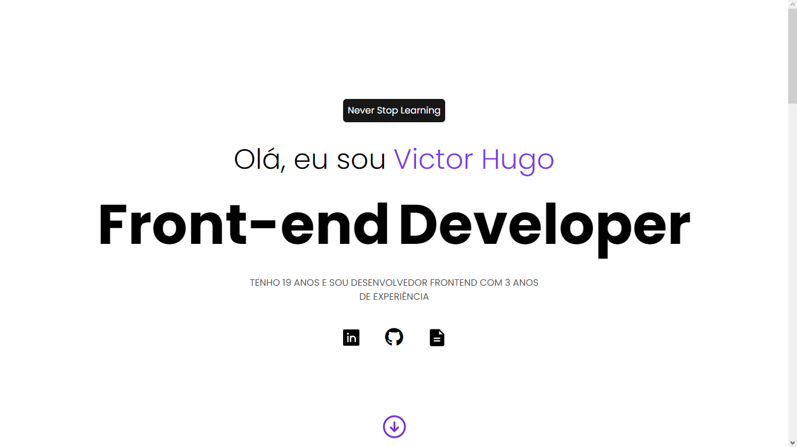

<h1 align="center"> Portfólio </h1>

  

 

  <h3>Web</h3>
  

  <h3>Mobile</h3>
  

## ✅ Status

 - Em produção ✅

## 🚀 Tecnologias

Esse projeto foi desenvolvido com as seguintes tecnologias:

- React
- Typescript
- Tailwindcss
- Styled Components
- Phosphor React
- Git e Github

## 💻 Projeto

Este projeto é o meu portfólio, onde eu mostro a minhas skills, redes sociais, projetos e te conto mais sobre mim.

- [Acesse o projeto finalizado, online](https://victorhm.vercel.app)

## :memo: Licença

Esse projeto está sob a licença MIT.
